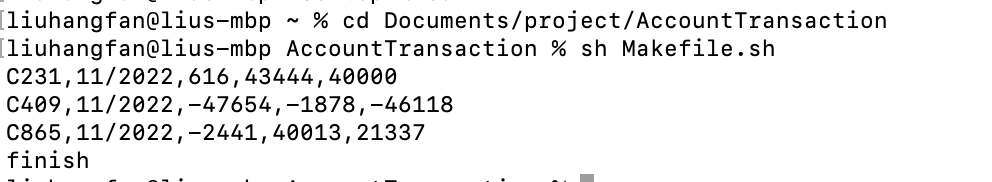

# guidance

1. prepare a csv file with the following columns:
    *  customerId: a unique identifier for the customer
    *  date: the date of the record, in the format "MM/DD/YYYY"
    *  amount: the amount of the transaction
2. change the value of ```inputPath``` in [application.properties](src/main/resources/application.properties) file. Let ```inputPath={your file path}```
   *   e.g. ```inputPath=Intern-AccountTransactions.csv```
3. change the value of ```outputPath``` in [application.properties](src/main/resources/application.properties) file. Let ```outputPath={your output path}```
   *   e.g. ```outputPath=output.csv```
4. run the project using [Makefile.sh](Makefile.sh)
   *   open your terminal, cd in this project root
   *   execute ```sh Makefile.sh``` in your terminal
   *   